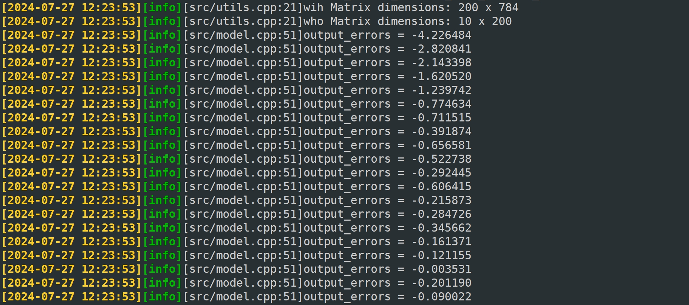

# Let's build a neural network from scratch together.😝

## Project Overview
Created a simple neural network using C++17 standard and the Eigen library that supports both forward and backward propagation.

By using only the sigmoid function as the activation function, the backpropagation process is very simple. With just a three-layer neural network structure consisting of an input layer, a hidden layer, and an output layer, this is a perfect case for beginners in deep learning.

The program's output is as follows:


## MNIST Dataset Format

The MNIST (Modified National Institute of Standards and Technology) dataset is a large database of handwritten digits commonly used for training and testing various machine learning models. Here's a detailed overview of its format:
- Number of Images: The dataset contains a total of 70,000 images. This includes 60,000 training images and 10,000 test images.
- Image Size: Each image is a 28x28 pixel grayscale image.
- Classes: There are 10 classes, each representing a digit from 0 to 9.

## Instructions
### Prerequisites
Make sure you have the following software installed:
- libeigen3-dev/focal,focal,now 3.3.7-2 all [installed]
- g++ (Ubuntu 7.5.0-6ubuntu2) 7.5.0

### Clone the Repository
```bash
git clone https://github.com/Phoenix8215/build_neural_network_from_scratch_CPP.git

cd build_neural_network_from_scratch_CPP

make

./netX
``````
After running the above command, you should see the following output:

